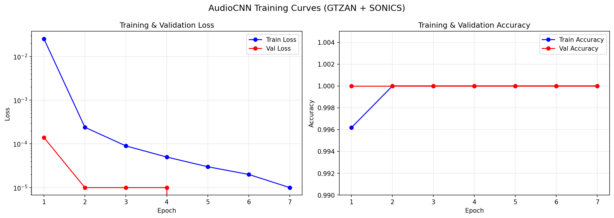
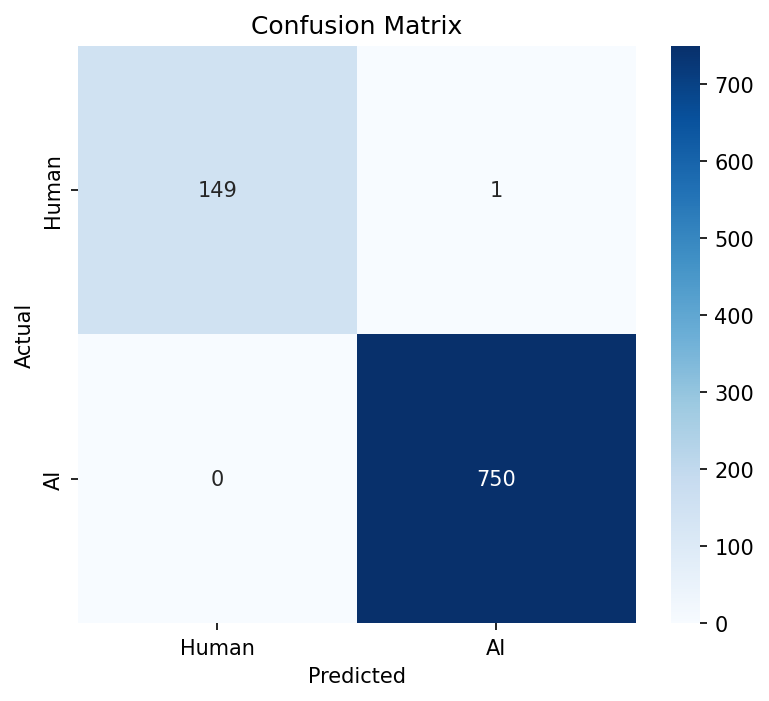

# MusicSourceClassifier 💿🎶 (Human vs. AI Music Detector and Top-K Similar Songs Recommender)

Created by Aditya Swaroop.

## Contents
- [Overview](#overview)
- [Key Features](#key-features)
- [Tech Stack](#tech-stack)
- [How It Works](#how-it-works)
- [Installation](#installation)
- [Model Training & Evaluation](#model-training--evaluation)
- [License](#license)

## Overview

MusicSourceClassifier is a full-stack audio analysis application designed to distinguish between **Human-Made** and **AI-Generated** music. By combining a custom Deep Learning classifier with audio fingerprinting technology, the system not only detects the origin of a track but also identifies real-world songs that sound similar to AI-generated uploads.

The core backend uses a binary classification CNN trained on Mel spectrograms and Similarity Search algorithm through FAISS and KNN to find the top $k$ most similar human-made tracks based on cosine similarity of waveform embeddings and genre similarity. The dataset comes from the GTZAN dataset for Human-Made tracks and SONICS for AI-Generated tracks.

## Key Features

*   **AI vs. Human Detection**: Uses a custom Convolutional Neural Network (CNN) trained on Mel spectrograms from GTZAN (human-made tracks) and SONICS (AI-generated tracks) datasets to classify audio files with high accuracy.
*   **Similarity Search**: If a song is flagged as AI-generated, the system uses **TorchOpenL3** embeddings and **FAISS** (Facebook AI Similarity Search) to find the top $k$ most similar human-made tracks from the GTZAN dataset.
*   **Interactive UI**: A polished, retro-vinyl themed interface built with React, featuring drag-and-drop file uploads, real-time status updates, audio visualizations, and a unified editorial results route for both verdict branches.
*   **Privacy-First**: Human-made tracks are deleted immediately after analysis to respect copyright and privacy; only AI tracks are temporarily processed for similarity matching.

## Tech Stack

### Backend
*   **Python & Flask**: RESTful API to handle file uploads and serve predictions.
*   **PyTorch**: Powers the custom CNN model (`AudioCNN`) for binary classification.
*   **Audio Processing**: `torchaudio` and `librosa` for spectrogram conversion.
*   **Similarity Engine**: `torchopenl3` for deep audio embeddings and `faiss` for efficient vector similarity search.
*   **Data Handling**: `pandas` and `numpy` for managing the SONICS and GTZAN dataset metadata and embeddings.

### Frontend
*   **React (Vite)**: Fast, modern frontend framework.
*   **TypeScript**: Ensures type safety and code maintainability.
*   **Tailwind CSS**: For responsive, modern styling.
*   **Custom UI primitives**: Lightweight accessible components tailored to the current interface.
*   **Visualizations**: Custom vinyl and waveform animations.

## How It Works

1.  **Upload**: User drags and drops an audio file (`.wav`, `.mp3`, `.flac`, `.ogg`) into the DropZone.
2.  **Preprocessing**: The backend converts the audio into a Mel spectrogram tensor.
3.  **Classification**: The CNN model analyzes the spectrogram features to predict the probability of the track being AI-generated.
4.  **Action**:
    *   **Human-Made**: The user is routed to `/results/human`, where the unified results page explains the verdict, confidence treatment, listening signals, model notes, and matched-track summary.
    *   **AI-Generated**: The user is routed to `/results/ai`, where the same results layout explains the verdict, confidence treatment, listening signals, model notes, and nearest human-made reference tracks.

### Unified Results Route

The showcase frontend now uses a single route pattern, `/results/:type`, for both analysis outcomes.

- The route restores the latest validated payload from session storage after refresh.
- The page reconciles the URL with the validated verdict if the route param and payload disagree.
- A share-summary card lets the user copy a concise, demo-ready summary of the current analysis.

## Page Results

Both verdict flows land on the unified `/results/:type` route so the AI and human outcomes feel equally complete while still tailoring the explanation to the verdict.

### Song is AI-Generated

- Used an AI-Generated song "fake_54229_udio_0.mp3" from the SONICS dataset. The system runs the file through the CNN model and finds that it is AI-Generated through binary classification.

- After finding that the song is AI-Generated, the system generates an audio embedding using TorchOpenL3 and queries the FAISS index to find the Top-K nearest "real song" neighbors from the GTZAN dataset, displaying them as similar tracks.


### Song is Human-Made

- Used a human-made GTZAN reference track to demonstrate the human verdict flow. The system runs the file through the CNN model and classifies it as human-made.
- The system maps the upload back to available catalog metadata so the human-side explanation can show a grounded reference when one is available.

## Project Structure

```
├── backend/
│   ├── app.py              # Flask entry point & configuration
│   ├── routes.py           # API endpoints
│   ├── cnn_model.py        # PyTorch CNN architecture
│   ├── audio_search.py     # Similarity search engine (FAISS + TorchOpenL3)
│   ├── utils.py            # Audio processing utilities
│   ├── globals.py          # Shared state management
│   ├── models/             # Trained .pth models
│   └── csv/                # Dataset metadata
├── training/
│   ├── download_datasets.py # Dataset download helpers
│   ├── train.py            # Training pipeline
│   └── evaluate.py         # Evaluation & metrics
├── notebooks/
│   └── training_and_evaluation.ipynb  # Full training notebook
├── results/                # Generated metrics, plots, logs
├── src/
│   ├── components/         # React components (DropZone, results cards, visualizers, etc.)
│   ├── pages/              # Main views (Index, Analyze, Results)
│   ├── hooks/              # Custom React hooks
│   └── lib/                # Utilities
└── public/                 # Static assets
```

## Installation

### Prerequisites
*   Node.js & npm
*   Python 3.11.14 (3.11.x)
*   (Optional) CUDA-enabled GPU for faster inference

### 1. Clone the Repository
```bash
git clone https://github.com/as567-code/MusicSourceClassifier.git
cd MusicSourceClassifier
```

### 2. Backend Setup
Create a virtual environment and install Python dependencies.

```bash
# Create virtual environment
python -m venv venv

# Activate virtual environment
# On macOS/Linux:
source venv/bin/activate
# On Windows:
# venv\Scripts\activate

# Install dependencies
pip install -r requirements.txt
```

> **Note**: For similarity search features, ensure you have the necessary model weights and index files in `backend/models/` and `backend/embeddings/`.

### 3. Frontend Setup
Install the Node.js dependencies.

```bash
npm install
```

## Running the Application

You can run both the frontend and backend concurrently (recommended) or separately.

### Concurrent Start

```bash
npm run dev
```

This command (configured in `package.json`) starts both the Vite dev server and the Flask backend.

### Manual Start

**Backend (Flask):**
```bash
source venv/bin/activate
python backend/app.py
```
The server will start at `http://localhost:8000`.

**Frontend (Vite):**
```bash
npm run dev:frontend
```

### Verification

Useful local verification commands:

```bash
venv/bin/python -m pytest backend/tests -q
npx vitest run src/pages/Results.test.tsx src/components/results/ShareSummaryCard.test.tsx
npm run lint
```

## Model Training & Evaluation

### Datasets

| Dataset | Class | Tracks | Duration | Source |
|---------|-------|--------|----------|--------|
| GTZAN | Human-made | 1,000 | 30s each | 10 genres (blues, classical, country, disco, hiphop, jazz, metal, pop, reggae, rock) |
| SONICS | AI-generated | ~1,000+ | Variable | Multiple AI music generators |

### Training Configuration

| Parameter | Value |
|-----------|-------|
| Architecture | AudioCNN (4 conv blocks) |
| Parameters | 421,825 |
| Input | Mel spectrogram (64 bins, 4s audio @ 22050 Hz) |
| Loss | Binary Cross-Entropy |
| Optimizer | Adam (lr=1e-3) |
| LR Schedule | ReduceLROnPlateau (factor=0.5, patience=2) |
| Early Stopping | Patience = 5 epochs |
| Train/Val/Test Split | 70% / 15% / 15% (stratified) |
| Batch Size | 32 |
| Epochs | 25 (max) |

### Results

*Trained on full GTZAN (1,000 human tracks) + SONICS (5,000 AI tracks). Stratified 70/15/15 split — 900 test samples (150 human, 750 AI).*

| Metric | Value |
|--------|-------|
| Test Accuracy | 99.89% |
| Precision (Human) | 100.0% |
| Recall (Human) | 99.33% |
| F1 (Human) | 99.67% |
| Precision (AI) | 99.87% |
| Recall (AI) | 100.0% |
| F1 (AI) | 99.93% |
| AUC-ROC | 1.000 |

> **Note**: Model converged in 2 epochs with early stopping at epoch 7. Only 1 misclassification out of 900 test samples.

### Training Curves



### Confusion Matrix



### How to Reproduce

```bash
# 1. Download datasets
pip install kaggle huggingface_hub
python training/download_datasets.py --output-dir data/

# 2. Train (25 epochs, ~1 hour on GPU)
python training/train.py --epochs 25 --batch-size 32 --data-dir data/

# 3. Evaluate (generates confusion matrix, ROC curve, metrics JSON)
python training/evaluate.py

# 4. Explore results in the notebook
jupyter notebook notebooks/training_and_evaluation.ipynb
```

### Project Structure (Training)

```
training/
  __init__.py
  download_datasets.py    # Dataset download helpers (GTZAN + SONICS)
  train.py                # Full training pipeline
  evaluate.py             # Evaluation with confusion matrix, ROC, metrics
notebooks/
  training_and_evaluation.ipynb   # Interactive notebook with ablation study
results/
  training_log.csv        # Per-epoch metrics
  eval_metrics.json       # Test set evaluation results
  confusion_matrix.png    # Confusion matrix heatmap
  roc_curve.png           # ROC curve with AUC
  training_curves.png     # Loss and accuracy curves
  mel_spectrogram_samples.png  # Sample spectrograms from each class
```

## License

This project is licensed under the MIT License – see the [LICENSE](LICENSE) file for details.
